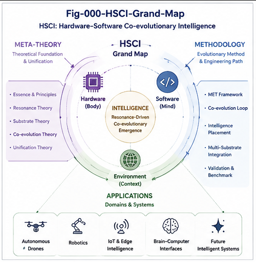
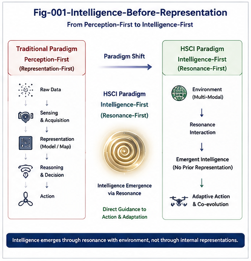
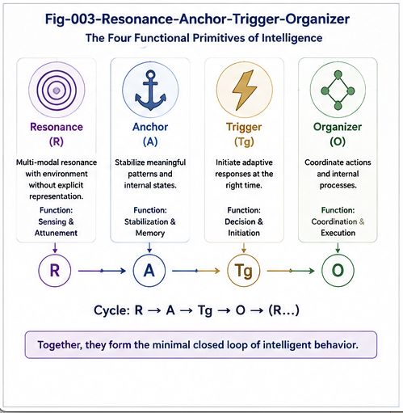
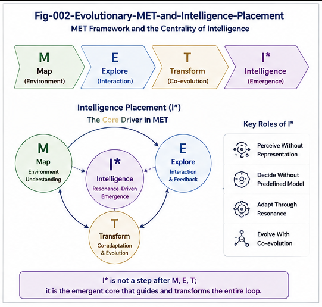
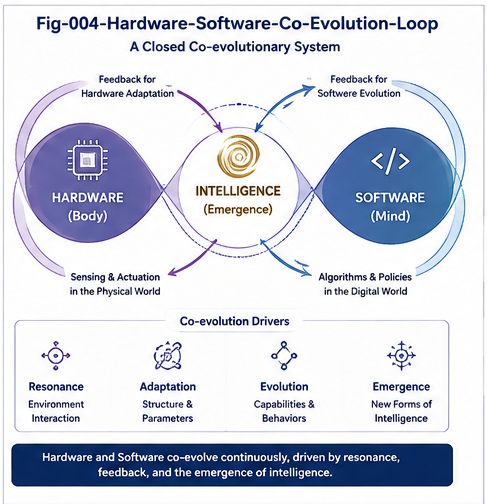
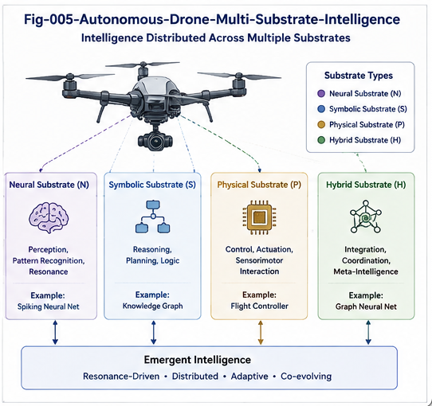

# Hardware–Software Co-Evolution of Intelligence

## From Physical Resonance and Salience to Structural Triggering and Cognitive Intelligence

> **Intelligence does not necessarily begin with representation.**
> It may begin when a physical or sensory difference acquires structural consequence.

---

## Overview

Modern artificial intelligence is usually built upon an implicit assumption:

```text id="35slp6"
Physical World
      ↓
Sensing
      ↓
Digital Representation
      ↓
AI Computation
      ↓
Decision
      ↓
Action
```

This repository explores a broader possibility:

```text id="4s2d7n"
Physical Difference
        ↓
Selective Coupling
        ↓
Resonance / Amplification
        ↓
Salience
        ↓
Structural Consequence
        ↓
Anchor / Trigger / Routing
        ↓
Selective Representation
        ↓
ANN / World Model / LLM
        ↓
Action
```

The central hypothesis is:

> **A system does not need to know exactly what something is before it can know, structurally, that something matters.**

This opens a wider architectural space for artificial intelligence.

Intelligent functions may be distributed across:

* physical structures,
* specialized sensors,
* analog mechanisms,
* event detectors,
* Boolean logic,
* CCC structural triggers,
* Function Tunnels,
* artificial neural networks,
* world models,
* large language models,
* Brain-Unit AI,
* and human intelligence.

The problem therefore changes from:

> **Which model should perform the intelligence?**

to:

> **Where should each intelligent distinction be physically and computationally realized?**

This repository calls that broader framework:

# Hardware–Software Co-Evolution of Intelligence — HSCI

---



---

# 1. Why HSCI?

AI is commonly discussed as software intelligence.

The world is sensed.

Signals are digitized.

Representations are constructed.

Models compute over those representations.

But physical systems can already perform selective operations before general representation exists.

Examples include:

```text id="dzgqf5"
Frequency Selectivity
Thermal Selectivity
Optical Selectivity
Mechanical Resonance
Vibration Response
Threshold Events
Event-Driven Sensing
Physical Stabilization
```

These mechanisms should not automatically be called intelligence.

The critical question is:

> **Does the physical or sensory difference alter what the system computes or does next?**

If it changes:

```text id="d45n1j"
Salience
Routing
State
Control
Attention
Memory
Sampling
Behavior
```

then it has acquired a **structural consequence**.

That is where HSCI begins.

---

# 2. Intelligence Before Representation





The central theoretical proposition of this repository is:

# Intelligence Before Representation

Traditional architecture often implies:

```text id="9cctgk"
Representation
      ↓
Intelligence
```

HSCI proposes:

```text id="p5m3ln"
Physical Difference
      ↓
Selective Response
      ↓
Salience
      ↓
Structural Consequence
      ↓
Intelligence Begins to Emerge
      ↓
Representation
      ↓
Higher Cognition
```

This does **not** mean that every sensor is intelligent.

It means that intelligence may emerge gradually before semantic representation is complete.

---

# 3. Structural Recognition Before Semantic Recognition

Consider an autonomous drone.

A conventional recognition path might be:

```text id="gn36i5"
Image
  ↓
Object Detection
  ↓
Classification
  ↓
Bird
  ↓
Trajectory Prediction
  ↓
Collision Risk
```

But the drone may detect:

```text id="pqly8a"
Optical Expansion
      +
Depth Change
      +
Motion Discontinuity
      ↓
High Structural Salience
      ↓
Collision Risk
```

before it knows:

```text id="m15fx3"
OBJECT = BIRD
```

The first recognition is:

> **Something structurally important is happening.**

The second recognition is:

> **What exactly is happening?**

HSCI calls this:

# Recognition Before Recognition

or more precisely:

```text id="dmqzqq"
Structural Recognition
        ↓
Semantic Recognition
```

---

# 4. Structural Consequence Boundary — SCB

HSCI introduces the:

# Structural Consequence Boundary — SCB

> **The Structural Consequence Boundary is the transition at which a physical or sensory difference begins to alter downstream computational structure, routing, state, control, or action.**

Conceptually:

```text id="4f4j5z"
Physical Signal
      ↓
Transformation
      ↓
Selective Response
      ↓
Salience
      ↓
------------------------- SCB
      ↓
Structural Consequence
      ↓
Trigger / Routing
      ↓
Behavior
```

The SCB does not need to be one literal hardware boundary.

It may be a distributed transition.

Its purpose is to help distinguish:

```text id="yzs6pn"
Signal Transformation
```

from:

```text id="i7gv71"
Intelligence-Relevant Structural Consequence
```

---

# 5. Structural Intelligence Emergence Gradient

Instead of forcing a binary boundary:

```text id="r1z69v"
Perception | Intelligence
```

HSCI proposes an emergence gradient:

```text id="j9qls7"
Physical Signal
      ↓
Selective Coupling
      ↓
Resonance
      ↓
Salience
      ↓
Structural Consequence
      ↓
Trigger
      ↓
Local Structural Organization
      ↓
Representation
      ↓
World Model
      ↓
Reasoning
```

The useful question becomes:

> **Which intelligence primitives have emerged at this layer?**

rather than:

> Is this layer intelligent or not?

---

# 6. Resonance, Salience, and Valence




Resonance is especially interesting because physical structure can selectively amplify certain environmental patterns.

However:

```text id="k0v20a"
Resonance ≠ Pleasure
```

A more careful conceptual chain is:

```text id="phl33b"
Physical Resonance
       ↓
Selective Amplification
       ↓
Salience
       ↓
Possible Valence
     ↙           ↘
Positive       Negative
```

HSCI does not claim that resonance explains subjective pleasure.

The narrower hypothesis is:

> **Selective physical or neural responses may provide pre-representational salience from which higher intelligence can organize structure.**

---

# 7. Anchor, Trigger, and Structural Organizer

A salient event may perform three different structural functions.

## Anchor

```text id="0b8ynw"
THIS matters.
```

An Anchor marks a location, feature, or moment as structurally important.

## Trigger

```text id="tb5r6m"
ACTIVATE this path.
```

A Trigger changes downstream computation or behavior.

## Structural Organizer

```text id="nugfzv"
ORGANIZE neighboring information around this point.
```

A Structural Organizer provides a local reference frame.

Together:

```text id="v5x9io"
Resonance / Salience
        ↓
 ┌──────┼───────────┐
 ↓      ↓           ↓
Anchor Trigger   Organizer
```

---

# 8. From Anchor to Starmap

A salient Anchor can organize nearby information.

### Sequence Starmap

```text id="r2lfs8"
t-3   t-2   t-1    A    t+1   t+2   t+3
                  ↑
                Anchor
```

### Image Starmap

```text id="r2n1wv"
             Feature B
                 |
Feature C ----- Anchor ----- Feature D
                 |
             Feature E
```

This suggests:

> **Structural organization can begin before semantic naming is complete.**

The system can first establish:

```text id="i01fcg"
relation
sequence
proximity
direction
change
salience
```

and determine detailed semantics later.

---

# 9. Hardware Intelligence Primitive — HIP

HSCI defines a:

# Hardware Intelligence Primitive — HIP

as a physically embodied mechanism that contributes to an intelligence-relevant structural consequence.

Conceptually:

```text id="uzg1cg"
Physical Mechanism
       +
Selective Response
       +
Structural Consequence
       =
Hardware Intelligence Primitive
```

Possible functions include:

```text id="g2d5ai"
Select
Amplify
Suppress
Anchor
Trigger
Gate
Route
Interrupt
Stabilize
Escalate
```

The key is not that the mechanism is hardware.

The key is that physical structure participates directly in an intelligent distinction.

---

# 10. Pre-Representational Intelligence Primitive — PRIP

The broader concept is:

# Pre-Representational Intelligence Primitive — PRIP

A PRIP creates intelligence-relevant structural consequence before a complete general representation exists.

Possible PRIPs include:

* Hardware Intelligence Primitives,
* event-driven selectors,
* threshold mechanisms,
* reflex controllers,
* CCC triggers,
* low-level anomaly detectors,
* sparse temporal gates,
* salience generators.

Thus:

```text id="87hvhl"
HIP ⊂ PRIP
```

---

# 11. Hardware Function Tunnel

A stable pathway can form when a recurring physical pattern repeatedly produces a useful structural response.

```text id="c0sjp8"
Physical Pattern
      ↓
Selective Response
      ↓
Salience
      ↓
Trigger
      ↓
Stable Functional Path
```

HSCI calls this a:

# Hardware Function Tunnel — HFT

> **A Hardware Function Tunnel is a stable physically embodied pathway through which a recurring class of environmental differences is selectively transformed into a reliable downstream structural consequence.**

---

# 12. Hardware Function Tunnel vs Hardware Accelerator

A conventional accelerator performs:

```text id="3c2ktk"
Known Computation
      ↓
Faster Execution
```

A Hardware Function Tunnel may instead perform:

```text id="27t64p"
Physical Difference
      ↓
Early Selection
      ↓
Structural Consequence
```

Therefore:

> **An accelerator makes computation cheaper.**

while:

> **A Hardware Function Tunnel may make some computation unnecessary.**

---

# 13. Multi-Substrate Function Tunnels

Function Tunnels can exist across many substrates:

```text id="7v5rdx"
Function Tunnel
│
├── Physical FT
├── Sensor FT
├── Analog FT
├── Control FT
├── Boolean FT
├── CCC FT
├── ANN FT
├── World-Model FT
├── Cognitive / LLM FT
└── Human FT
```

A future intelligence system can therefore be understood as a:

# Multi-Substrate Function-Tunnel Network

rather than a single model.

---

# 14. Per-Function Intelligence Placement



The central engineering question becomes:

> **Where should each intelligent function live?**

For an intelligence function \(F\):

$$
P^*(F)
=
\arg\min_{P}
J(F,P)
$$

A conceptual objective may include:

$$
J
=
\alpha E
+
\beta L
+
\gamma C
+
\delta R
+
\epsilon W
+
\zeta A
$$

where:

* \(E\) = energy,
* \(L\) = latency,
* \(C\) = computation,
* \(R\) = reliability / risk cost,
* \(W\) = physical cost / weight,
* \(A\) = adaptation cost.

Possible placements include:

```text id="3pm1jr"
Physical Structure
Sensor
Analog Circuit
Boolean
CCC
ANN
World Model
LLM
Human
```

The formula is conceptual rather than a universal fixed optimization law.

---

# 15. Smallest Sufficient Intelligence

This leads to one of the central engineering principles of HSCI:

> **Put the smallest sufficient intelligence at the earliest effective layer.**

Not:

```text id="nt2kt4"
Smallest Intelligence
```

at any cost.

But:

```text id="e35rrb"
Smallest
+
Sufficient
+
Safe
+
Reliable
```

intelligence.

---

# 16. Selective Upward Escalation

A multi-substrate runtime does not need to invoke its most expensive intelligence for every event.

```text id="djdtx6"
Physical / Sensor
       ↓
Resolved?
├── YES → Act
└── NO
     ↓
Boolean / CCC
     ↓
Resolved?
├── YES → Act
└── NO
     ↓
ANN
     ↓
Resolved?
├── YES → Act
└── NO
     ↓
World Model
     ↓
LLM
     ↓
Human
```

This is:

# Selective Upward Escalation

---

# 17. Downward Structural Consolidation

Intelligence can also move in the opposite direction.

```text id="ymvuyf"
Flexible High-Level Solution
        ↓
Repeated Success
        ↓
Stable Structural Regularity
        ↓
Function Tunnel
        ↓
Cheaper Implementation
```

Possible migration:

```text id="dq9v7x"
LLM
 ↓
World Model
 ↓
ANN
 ↓
CCC
 ↓
Boolean
 ↓
Hardware
```

This is:

# Downward Structural Consolidation

A useful compact principle is:

> **Novelty moves upward. Stability moves downward.**

---

# 18. Hardware–Software Co-Evolution



The two directions form a loop:

```text id="xoq3zh"
Hardware Bias
      ↓
Software Learning
      ↓
Repeated Structural Regularity
      ↓
Function Tunnel
      ↓
Validation
      ↓
Hardware Consolidation
      ↓
New Hardware Bias
      ↺
```

Hardware and software therefore should not be treated as competing paradigms.

They can become:

# Co-Evolving Intelligence Substrates

---

# 19. Multi-Timescale Intelligence

Different intelligence substrates naturally operate at different timescales.

```text id="t0xg3h"
μs–ms
Physical / Hardware Intelligence
        ↓

ms
Salience / Trigger
        ↓

ms–10 ms
Control / Emergency FT
        ↓

10–100 ms
Boolean / CCC / ANN
        ↓

100 ms–seconds
World Model / Trajectory Intelligence
        ↓

seconds+
LLM / Brain-Unit Intelligence
```

Therefore:

> **Intelligence need not share one substrate, one representation, or one clock.**

---

# 20. Normal vs Emergency Intelligence

A normal intelligence path may use:

```text id="ob0szg"
Perception
    ↓
Representation
    ↓
World Model
    ↓
Prediction
    ↓
Planning
    ↓
Action
```

An emergency path may use:

```text id="sqo8gg"
Physical Difference
      ↓
Salience
      ↓
Emergency Trigger
      ↓
Emergency Function Tunnel
      ↓
Immediate Action
```

The governing principle is:

> **Act intelligently before fully understanding when latency dominates semantic completeness.**

---

# 21. Capability Is Not Authority

A larger model may possess greater general capability.

That does not mean it should always possess greater runtime authority.

For example:

```text id="jhmhfv"
LLM
```

may understand an event more deeply than:

```text id="dlcgyh"
Collision Trigger
```

but during an immediate collision:

```text id="ydm7no"
Collision Trigger
```

may have higher action authority.

Therefore:

> **Capability hierarchy is not authority hierarchy.**

This distinction becomes critical in safety-sensitive multi-substrate AI.

---

# 22. Brain-Unit AI

HSCI leads naturally toward a broader Brain-Unit architecture.

A Brain Unit is not merely:

```text id="i2ov64"
LLM + Tools
```

It may contain:

```text id="os9mqs"
Brain Unit
│
├── Physical Intelligence
├── Sensor Intelligence
├── Salience / Triggering
├── Hardware Function Tunnels
├── Boolean Logic
├── CCC Structural Routing
├── ANN Specialists
├── World Models
├── Trajectory Intelligence
├── Emergency Intelligence
├── LLM Reasoning
├── Memory
├── Policy
├── Runtime Governance
└── Human Escalation
```

This makes Brain-Unit AI:

```text id="86hujp"
Multi-Substrate
+
Multi-Timescale
+
Multi-Representation
+
Policy-Routed
+
Structurally Governed
```

---

# 23. Brain Unit as Dispatcher

A future Brain Unit may increasingly perform:

# Intelligence Dispatch

rather than universal computation.

```text id="9tpsvo"
Event
  ↓
Structural Characterization
  ↓
Dispatch
  ├── Hardware FT
  ├── Boolean
  ├── CCC
  ├── ANN
  ├── World Model
  ├── LLM
  └── Human
```

The principle becomes:

> **Right intelligence. Right function. Right substrate. Right time.**

---

# 24. Autonomous Drones: Canonical Engineering Testbed




Autonomous drones provide a particularly strong HSCI test environment.

They operate under simultaneous constraints:

```text id="5dxu6b"
Energy
Weight
Latency
Compute
Bandwidth
Thermal Budget
Reliability
Flight Time
Safety
```

This makes intelligence placement directly measurable.

A representation-first architecture may use:

```text id="9up6yb"
Sensor
  ↓
Digitization
  ↓
Full Representation
  ↓
ANN
  ↓
World Model
  ↓
Decision
```

An HSCI architecture may use:

```text id="26j29k"
Sensor
  ↓
Physical / Sensor Selectivity
  ↓
Salience
  ↓
Trigger
  ├── Ignore
  ├── Emergency FT
  └── Selective Representation
           ↓
          ANN
           ↓
      World Model
```

---

# 25. Drone Example — Collision Avoidance

A semantic path:

```text id="v6o9lb"
Camera
  ↓
ANN
  ↓
Object = Bird
  ↓
Trajectory
  ↓
Collision Risk
  ↓
Avoid
```

A structural fast path:

```text id="ct9kz4"
Optical Expansion
      +
Depth Change
      +
Motion Discontinuity
      ↓
Collision Salience
      ↓
Emergency Trigger
      ↓
AVOID
```

The drone can act first.

It can understand more completely afterward.

---

# 26. Drone Example — Mechanical Anomaly

The drone body itself can reveal useful structure.

```text id="5znj6m"
Vibration Anomaly
      ↓
Mechanical Salience
      ↓
Stability Trigger
      ↓
Safe Flight Profile
```

while in parallel:

```text id="dm5vm5"
Vibration Data
      ↓
ANN
      ↓
Detailed Diagnosis
```

The system first determines:

> **Something is wrong.**

Then:

> **What exactly is wrong?**

---

# 27. Autonomous Drones as a Model Organism

Drones combine:

* physical intelligence,
* sensor intelligence,
* structural triggering,
* Function Tunnels,
* ANN,
* world models,
* trajectory intelligence,
* emergency intelligence,
* Brain-Unit reasoning,
* and measurable physical constraints.

For this reason:

> **Autonomous drones can serve as a model organism for structural intelligence engineering.**

They provide a compact environment in which HSCI can be tested rather than merely discussed.

---

# 28. Canonical A/B Experiment

## Architecture A — Representation First

```text id="yjkbsh"
Sensor
  ↓
Full Representation
  ↓
ANN
  ↓
World Model
  ↓
Decision
```

## Architecture B — HSCI

```text id="igbb2s"
Sensor
  ↓
Early Structural Selection
  ↓
Salience
  ↓
Trigger
  ├── Direct FT
  └── Selective ANN
          ↓
     World Model
```

Measure:

```text id="qfwb5q"
Energy
Latency
Compute
ANN Calls
Memory Traffic
False Triggers
Miss Rate
Response Time
Flight Time
Safety
```

---

# 29. HSCI Must Be Falsifiable

HSCI does not require Architecture B to win.

If early intelligence placement produces:

```text id="hmngyo"
Lower Latency
```

but:

```text id="aofvs3"
Unacceptable Miss Rate
```

the placement is insufficient.

If it produces:

```text id="98qj9w"
More Complexity
+
No Significant Energy Saving
+
No Significant Latency Saving
```

the placement may not be justified.

Therefore:

> **HSCI should be experimentally falsifiable at the function-placement level.**

---

# 30. Structural Placement Scaling

Modern AI emphasizes:

# Compute Scaling

```text id="a5ox6e"
More Data
+
More Parameters
+
More Compute
      ↓
More Capability
```

HSCI introduces a complementary direction:

# Structural Placement Scaling

```text id="9f7jv8"
Better Physical Selection
+
Better Salience
+
Better Triggering
+
Better Routing
+
Better Intelligence Placement
      ↓
Less Unnecessary Computation
      ↓
Higher Effective Intelligence
```

The strongest future systems may combine both.

---

# 31. Core HSCI Principles

### 1. Intelligence Before Representation

> Intelligence does not necessarily begin with a complete internal representation.

### 2. Structural Consequence

> A physical difference becomes intelligence-relevant when it alters downstream structure, routing, state, control, or behavior.

### 3. Recognition Before Recognition

> Structural significance can be recognized before semantic identity.

### 4. Hardware Participation

> Physical structure can participate directly in intelligent selection.

### 5. Smallest Sufficient Intelligence

> Put the smallest sufficient intelligence at the earliest effective layer.

### 6. Selective Escalation

> Escalate toward expensive flexible intelligence only when simpler substrates are insufficient.

### 7. Structural Consolidation

> Repeated stable intelligence can become a candidate for cheaper structural realization.

### 8. Multi-Timescale Intelligence

> Intelligence need not share one substrate, one representation, or one clock.

### 9. Governed Function Tunnels

> Every narrow fast path requires explicit invariants, authority, and escape.

### 10. Hardware–Software Co-Evolution

> Hardware and software intelligence should be treated as co-evolving substrates rather than competing paradigms.

---

# 32. Research Documents

The first HSCI research cycle contains four core documents.

### HSCI-001 — Hardware–Software Co-Evolution of Intelligence

**From Evolutionary Selection to Multi-Substrate Intelligence**

Introduces:

* Representation-First Assumption
* Intelligence Before Representation
* Hardware Intelligence
* Structural Consequence
* Multi-Substrate Intelligence
* Per-Function Intelligence Placement
* Hardware–Software Co-Evolution

---

### HSCI-002 — Resonance, Salience, and Triggering

**Intelligence Before Representation**

Develops:

* Physical Difference
* Selective Coupling
* Resonance
* Salience
* Structural Consequence Boundary
* Anchor
* Trigger
* Structural Organizer
* Sequence Starmap
* Image Starmap
* Selective Representation

---

### HSCI-003 — From Hardware Function Tunnels to Brain-Unit AI

**Intelligence Placement Across Physical, Structural, Neural, and Generative Substrates**

Develops:

* Hardware Function Tunnels
* Multi-Substrate FT Networks
* Per-Function Intelligence Placement
* Selective Upward Escalation
* Downward Structural Consolidation
* Multi-Timescale Intelligence
* Runtime Invariants
* Structural Governance
* Brain-Unit AI

---

### HSCI-004 — Intelligence Before Representation in Autonomous Drones

**A Canonical Testbed for Hardware–Software Structural Intelligence**

Develops:

* Representation Cost
* Drone Hardware Intelligence
* Collision Function Tunnels
* Mechanical Anomaly Intelligence
* Normal vs Emergency Intelligence
* Architecture A/B
* Validation Metrics
* Failure Criteria
* Autonomous Flight Brain Unit

---

# 33. Figures

The first HSCI Figure Pack contains six figures.

```text id="2qk3dk"
figures/
│
├── Fig-000-HSCI-Grand-Map.png
│
├── Fig-001-Intelligence-Before-Representation.png
│
├── Fig-002-Evolutionary-MET-and-Intelligence-Placement.png
│
├── Fig-003-Resonance-Anchor-Trigger-Organizer.png
│
├── Fig-004-Hardware-Software-Co-Evolution-Loop.png
│
└── Fig-005-Autonomous-Drone-Multi-Substrate-Intelligence.png
```

### Fig-000 — HSCI Grand Map

The complete HSCI landscape from physical-world interaction through hardware–software co-evolution and multi-substrate intelligence.

### Fig-001 — Intelligence Before Representation

The transition from representation-first thinking toward intelligence emerging through selective physical interaction and structural consequence.

### Fig-002 — Evolutionary MET and Intelligence Placement

Intelligence placement as a core optimization problem across environment, interaction, adaptation, and structural evolution.

### Fig-003 — Resonance, Anchor, Trigger, Organizer

The functional primitives connecting selective response with stabilization, activation, and structural organization.

### Fig-004 — Hardware–Software Co-Evolution Loop

Hardware, software, and emergent intelligence connected through adaptation, feedback, and structural evolution.

### Fig-005 — Autonomous Drone Multi-Substrate Intelligence

Autonomous flight as a concrete multi-substrate intelligence system combining physical, neural, symbolic, and hybrid intelligence.

---

# 34. Repository Structure

```text id="gxw2os"
Hardware-Software-Co-Evolution-of-Intelligence/
│
├── README.md
├── START-HERE.md
│
├── HSCI-001-Hardware-Software-Co-Evolution-of-Intelligence.md
├── HSCI-002-Resonance-Salience-and-Triggering.md
├── HSCI-003-From-Hardware-Function-Tunnels-to-Brain-Unit-AI.md
├── HSCI-004-Intelligence-Before-Representation-in-Autonomous-Drones.md
│
├── figures/
│   ├── Fig-000-HSCI-Grand-Map.png
│   ├── Fig-001-Intelligence-Before-Representation.png
│   ├── Fig-002-Evolutionary-MET-and-Intelligence-Placement.png
│   ├── Fig-003-Resonance-Anchor-Trigger-Organizer.png
│   ├── Fig-004-Hardware-Software-Co-Evolution-Loop.png
│   └── Fig-005-Autonomous-Drone-Multi-Substrate-Intelligence.png
│
├── FIGURE-INDEX.md
├── FUTURE-DIRECTIONS.md
├── CITATION.cff
└── .zenodo.json
```

---

# 35. Suggested Reading Path

For a first reading:

```text id="3bquj7"
README
   ↓
Fig-000
   ↓
HSCI-001
   ↓
Fig-001
   ↓
HSCI-002
```

For architecture:

```text id="cjx7u1"
HSCI-003
   ↓
Fig-004
```

For engineering validation:

```text id="dnrrc2"
HSCI-004
   ↓
Fig-005
   ↓
Architecture A/B
```

The complete path is:

```text id="rhrnhc"
WHY
HSCI-001
   ↓

HOW INTELLIGENCE BEGINS
HSCI-002
   ↓

HOW INTELLIGENCE IS PLACED
HSCI-003
   ↓

HOW TO TEST IT
HSCI-004
```

---

# 36. What HSCI Does Not Claim

HSCI does not claim that:

* every physical response is intelligence;
* every sensor is intelligent;
* resonance is equivalent to pleasure;
* hardware is universally superior to software;
* ANN or LLM intelligence should be replaced;
* world models are unnecessary;
* representation is unnecessary;
* all intelligent functions should migrate into hardware;
* biological evolution is reducible to a simple engineering optimization;
* HSCI has already been experimentally validated.

The narrower thesis is:

> **Some intelligent selection can occur before general representation, and AI architecture should explicitly consider where each intelligent distinction is best realized.**

---

# 37. Research Program

The immediate HSCI research program asks:

```text id="ygp6eg"
Can intelligence begin before representation?
        ↓
Can structural consequence be measured?
        ↓
Can Hardware Intelligence Primitives be identified?
        ↓
Can Hardware Function Tunnels be constructed?
        ↓
Can intelligence placement be optimized?
        ↓
Can ANN / LLM computation be selectively activated?
        ↓
Can stable software intelligence consolidate downward?
        ↓
Can Brain-Unit AI coordinate multiple substrates?
        ↓
Can autonomous drones validate the architecture?
```

---

# 38. Canonical HSCI Grand Path

```text id="h63a94"
PHYSICAL WORLD
      ↓
PHYSICAL DIFFERENCE
      ↓
SELECTIVE COUPLING
      ↓
RESONANCE / AMPLIFICATION
      ↓
SALIENCE
      ↓
STRUCTURAL CONSEQUENCE
      ↓
ANCHOR / TRIGGER / ORGANIZER
      ↓
FUNCTION TUNNEL
      ↓
SELECTIVE REPRESENTATION
      ↓
CCC / ANN
      ↓
WORLD MODEL
      ↓
LLM / BRAIN UNIT
      ↓
ACTION
      ↓
RUNTIME TRACE
      ↓
STRUCTURAL LEARNING
      ↓
FUNCTION-TUNNEL EVOLUTION
      ↓
HARDWARE–SOFTWARE CO-EVOLUTION
```

---

# 39. Canonical Statements

> **Intelligence does not necessarily begin with representation.**

> **Intelligence may begin when a physical or sensory difference acquires structural consequence.**

> **A system does not need to know what something is before it can know, structurally, that something matters.**

> **Structural recognition can precede semantic recognition.**

> **Hardware intelligence belongs inside the AI architecture—not merely underneath it.**

> **An accelerator makes computation cheaper; a Hardware Function Tunnel may make some computation unnecessary.**

> **Do not compute what physics can already select.**

> **Do not ask an ANN to rediscover a distinction that a sensor can physically expose.**

> **Put the smallest sufficient intelligence at the earliest effective layer.**

> **Novelty moves upward. Stability moves downward.**

> **Capability hierarchy is not authority hierarchy.**

> **Intelligence need not share one substrate, one representation, or one clock.**

> **Right intelligence. Right function. Right substrate. Right time.**

---

# 40. One-Sentence Definition

> **Hardware–Software Co-Evolution of Intelligence (HSCI) studies how intelligent functions can emerge, migrate, specialize, cooperate, and be governed across physical, sensory, structural, neural, representational, and generative substrates.**

---

# 41. Closing Perspective

The history of artificial intelligence has largely been the history of making computation more capable.

HSCI asks a complementary question:

> **Can the structure of the system make less computation necessary?**

The physical world already contains structure.

Sensors can selectively expose it.

Resonance can amplify it.

Salience can prioritize it.

Triggers can route it.

Function Tunnels can preserve it.

ANNs can learn from it.

World models can organize it.

LLMs can reason over it.

Brain Units can coordinate it.

The future of AI may therefore depend not only on building larger models.

It may also depend on discovering:

> **where intelligence should live.**

---

## HSCI

### Hardware–Software Co-Evolution of Intelligence

**From Physical Resonance and Salience to Structural Triggering and Cognitive Intelligence**

> **The future of AI may depend not only on building larger models, but on placing smaller forms of intelligence at the right physical and structural locations.**
